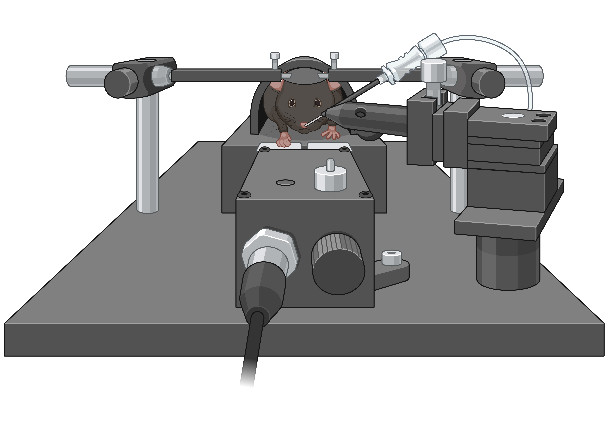
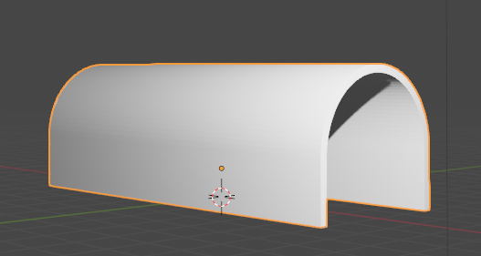

# MouseHeadFix
Equipment for lab mouse experiments facilitated by head fixation  

<i>Image courtesy of Kirsty Erickson (Cody Siciliano lab)</i>

### Files
Files include both [Blender](https://www.blender.org/) **.blend** design files as well as exported **.STL** files for 3D printing. These files have been printed previously on a FlashForge Creator Pro in Black PLA, but should be printable on many other 3D printers. We have typically used them on an optical breadboard platform in which optical mounts are used to secure the platform, tunnel, and head bar holders.

### [HeadBar](HeadBar/)
The head bar should be placed horizontally on the mouse's skull and secured with a firm cement such as MetaBond. The centering tab is not necessary and only included to make aligning with the midline slightly easier. Without the tab the bar can be machined easily using 2mm x 2mm stock aluminum or another metal  

### [Head Bar Holder](HeadBarHolder/)
A pair of holders secure either end of the head bar, through the use of a 4-40 screw that creates a friction hold on the head bar. The head bar holders can be threaded with 8-32 screws for example on the end of 1/2" optical posts (for example from [ThorLabs](https://www.thorlabs.com/newgrouppage9.cfm?objectgroup_id=1266) . We have used 3D printed holders, as well as holder machined from metal by digital manufacturing companies  

### [Platform](MousePlatform/)
We used a simple open box like platform to raise the mouse to a comfortable height above the table.  

### [Tunnel](MouseTunnel/)
The tunnel can be used to provide the mouse with shelter while head fixed on the platform.  We have kept the tunnel secured by using rubber bands  that are secured onto screws alongside the platform.

